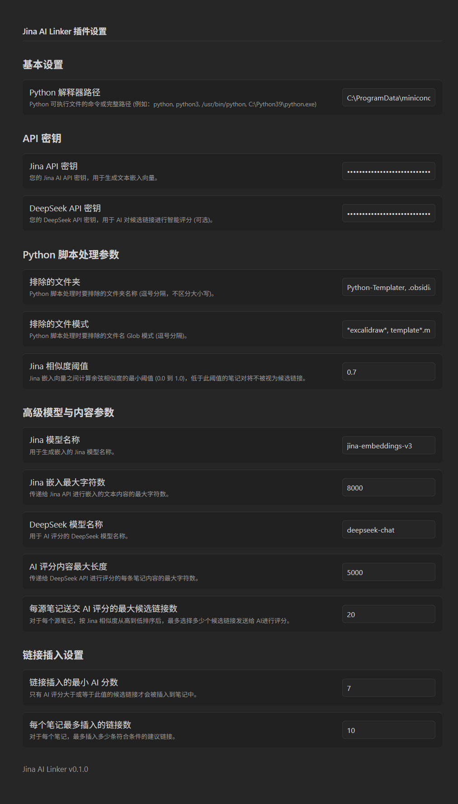
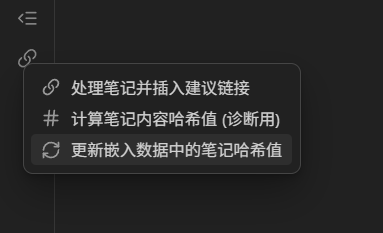

# Jina AI Linker 插件

> 为 **Obsidian** 打造的 AI 级链接推荐助手，基于 **Jina Embeddings** 与多家 LLM 服务，为你的笔记自动建立知识网络。





---

## 功能特性

| 模块 | 亮点 |
|------|------|
| 嵌入生成 | • 调用 **Jina AI Cloud Embeddings**\
| 链接候选 | • NumPy 批量计算余弦相似度，生成高效候选集 |
| AI 智能评分 | • 支持 **OpenAI / DeepSeek / Claude / Gemini / 任意 OpenAI-兼容 API**\
| 建议链接插入 | • 基于阈值自动写回 Markdown\
| 内容追踪 | • `<!-- HASH_BOUNDARY -->` 哈希边界避免重复处理 |
| 多端存储 | • 嵌入 / AI 评分结果独立 JSON 文件，笔记保持纯净 |
| 可扩展 | • Python 与 TypeScript 解耦，易于二次开发 |

---

## 快速上手（普通用户）

### 1. 安装插件

1. 前往 [Releases](https://github.com/eacheat53/Jina-AI-Linker/releases) 下载最新 `zip`。
2. 解压到仓库的 `.obsidian/plugins/` 目录。
3. 打开 Obsidian → 设置 → 第三方插件 → 启用 **Jina AI Linker**。

### 2. 准备 API Key

| 服务 | 用途 | 申请地址 |
|------|------|-----------|
| **Jina AI Cloud** | 生成文本嵌入 | <https://jina.ai> |
| **LLM 提供商** | 生成 AI 相关度分 | DeepSeek / OpenAI / Claude / Gemini / 兼容服务（任选其一） |

### 3. 首次运行流程

1. 打开侧边栏图标，执行「批量添加哈希边界标记」，为旧笔记加上 `<!-- HASH_BOUNDARY -->`。
2. 在设置页输入 Jina Key、选择 LLM 供应商并填写对应 Key & Model。
3. 运行「处理笔记并插入建议链接」。
4. 准备好咖啡 ☕，等待处理完成即可看到自动插入的 `[[建议链接]]`。

---

## Windows / macOS / Linux —— Python 环境安装指南


### 1. 安装 Python 3.9+

- Windows：<https://www.python.org/downloads/windows/>，安装时勾选「Add python.exe to PATH」。
- macOS：建议使用 Homebrew `brew install python@3.12`。
- Linux：发行版包管理器或官方安装包。

### 2. 创建隔离虚拟环境

```bash
python -m venv .jina_linker          # 在项目根目录执行
# Windows PowerShell
.\.jina_linker\Scripts\Activate.ps1
# macOS / Linux
source .jina_linker/bin/activate
```

### 3. 安装依赖

```bash
pip install -r requirements.txt
```

安装完成后可执行：

```bash
python -m python_src.cli --help
```

若看到帮助信息则说明环境 OK。

---

## 目录结构速览

```text
.
├─ main.ts / main.js     # Obsidian 插件入口
├─ services/             # 与 Obsidian 交互的业务层 (TS)
├─ core/                 # 与平台无关的纯逻辑 (TS)
├─ ui/                   # 设置面板 & Modal (TS)
├─ python_src/           # Python 后端脚本（嵌入、AI 评分等）
└─ tests/                # Python 单元测试
```

---

## 常见问题（FAQ）

| 问题 | 解答 |
|------|------|
| **如何加速 Jina Embedding 调用？** | 购买 Jina AI 付费额度或自行部署本地向量模型 |
| **为什么没生成任何建议链接？** | 检查是否添加 `<!-- HASH_BOUNDARY -->`，以及相似度 / 分数阈值是否过高 |
| **能否只用相似度、不用 AI 评分？** | 可以，在设置里将「AI 评分」模式设为“仅相似度阈值” |
| **如何更新依赖？** | `npm update` / `pip install -U -r requirements.txt` |

---

## 贡献

欢迎 Issue / PR！请遵循 **[贡献指南](CONTRIBUTING.md)**（待撰写）。

---

## License

Apache-2.0 © 2024 eacheat53 
