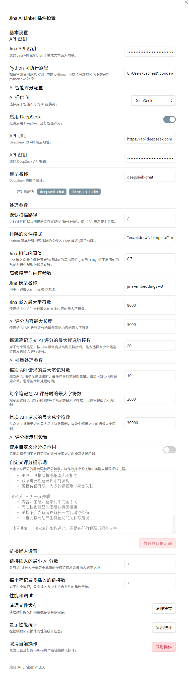

# Jina AI Linker 插件

> 为 **Obsidian** 打造的 AI 级链接推荐助手，基于 **Jina Embeddings** 与多家 LLM 服务，为你的笔记自动建立知识网络。



---

## 功能特性

| 模块 | 亮点 |
|------|------|
| 嵌入生成 | • 调用 **Jina AI Cloud Embeddings**\
| 链接候选 | • NumPy 批量计算余弦相似度，生成高效候选集 |
| AI 智能评分 | • 支持 **OpenAI / DeepSeek / Claude / Gemini / 任意 OpenAI-兼容 API**\
| 建议链接插入 | • 基于阈值自动写回 Markdown\
| 内容追踪 | • `<!-- HASH_BOUNDARY -->` 哈希边界避免重复处理 |
| 多端存储 | • 嵌入 / AI 评分结果独立 SQL，笔记保持纯净 |

---

## 快速上手（普通用户）

### 1. 安装插件

1. 前往 [Releases](https://github.com/eacheat53/Jina-AI-Linker/releases) 下载最新 `zip`。
2. 解压到仓库的 `.obsidian/plugins/` 目录。
3. 打开 Obsidian → 设置 → 第三方插件 → 启用 **Jina AI Linker**。

### 2. 准备 API Key

| 服务 | 用途 | 申请地址 |
|------|------|-----------|
| **Jina AI Cloud** | 生成文本嵌入 | <https://jina.ai> |
| **LLM 提供商** | 生成 AI 相关度分 | DeepSeek / OpenAI / Claude / Gemini / 兼容服务（任选其一） |

### 3. 首次运行流程

1. 打开侧边栏图标，执行「批量添加哈希边界标记」，为旧笔记加上 `<!-- HASH_BOUNDARY -->`。
2. 在设置页输入 Jina Key、选择 LLM 供应商并填写对应 Key & Model。
3. 运行「处理笔记并插入建议链接」。
4. 准备好咖啡 ☕，等待处理完成即可看到自动插入的 `[[建议链接]]`。

---

## Windows / macOS / Linux —— Python 环境安装指南


### 1. 安装 Python 3.9+

- Windows：<https://www.python.org/downloads/windows/>，安装时勾选「Add python.exe to PATH」。
- macOS：建议使用 Homebrew `brew install python@3.12`。
- Linux：发行版包管理器或官方安装包。

### 2. 创建隔离虚拟环境

```bash
python -m venv .jina_linker          # 在项目根目录执行
# Windows PowerShell
.\.jina_linker\Scripts\Activate.ps1
# macOS / Linux
source .jina_linker/bin/activate
```

### 3. 安装依赖

```bash
pip install -r requirements.txt
```

安装完成后可执行：

```bash
python -m python_src.cli --help
```

若看到帮助信息则说明环境 OK。

---

## 目录结构速览

```text
.
├─ main.ts / main.js     # Obsidian 插件入口
├─ services/             # 与 Obsidian 交互的业务层 (TS)
├─ core/                 # 与平台无关的纯逻辑 (TS)
├─ ui/                   # 设置面板 & Modal (TS)
├─ python_src/           # Python 后端脚本（嵌入、AI 评分等）
└─ tests/                # Python 单元测试
```

---

## 常见问题（FAQ）

| 问题 | 解答 |
|------|------|
| **为什么没生成任何建议链接？** | 检查是否添加 `<!-- HASH_BOUNDARY -->`，以及相似度 / 分数阈值是否过高 |

---

## 贡献

欢迎 Issue / PR！请遵循 **[贡献指南](CONTRIBUTING.md)**（待撰写）。

<!-- ------------------------------------------------------------------ -->

## 文件功能一览

> 以下列表仅涵盖主流程中最常用、最关键的 TypeScript / Python 文件，其余如工具类、常量枚举、类型定义等未全部列出，可按需检索。目录与文件名皆为相对仓库根目录路径。

| 路径 | 语言 | 作用简介 |
|------|------|-----------|
| **main.ts** | TS | Obsidian 插件入口：初始化各 Service、注册命令 / Ribbon / SettingTab，并驱动前端-后端整体流程。 |
| services/hash-manager.ts | TS | 计算笔记正文（由 `<!-- HASH_BOUNDARY -->` 标记截断） SHA-256 哈希，供重复检测与缓存失效判断。 |
| services/link-manager.ts | TS | 负责把后端 AI 评分结果转为 Markdown 建议链接并插入原笔记。包含去重逻辑与 YAML front-matter 更新。 |
| services/tag-manager.ts | TS | 将 Python 生成的 `ai_tags.json` 写回笔记 front-matter `tags` 字段，支持批量智能 / 强制插入。 |
| services/file-processor.ts | TS | 与 `HashManager` 协作，为选中文件批量插入 `<!-- HASH_BOUNDARY -->` 标记等文件级操作。 |
| utils/python-bridge.ts | TS | Node 子进程封装器：拼装 CLI 参数、启动 `python_src/cli.py`，并流式监听日志与进度反馈。 |
| ui/settings-tab.ts | TS | 插件「设置」面板：渲染全部配置项（API Key、阈值、提示词等），并负责保存、重渲染。 |
| ui/modals/run-plugin-modal.ts | TS | “运行选项”弹窗：让用户选择扫描路径、评分模式后触发完整处理流程。 |
| ui/modals/add-hash-boundary-modal.ts | TS | “批量添加哈希边界标记” 弹窗，配合 `FileProcessor` 使用。 |
| ui/modals/add-ai-tags-modal.ts | TS | “批量插入 AI 标签” 弹窗，收集目标路径与模式后调用 `runTagOnlyFlow`。 |
| models/settings.ts | TS | 插件所有可持久化配置项的类型与默认值，含评分 / 标签提示词常量。 |
| **python_src/cli.py** | PY | 后端统一入口：解析参数、调用嵌入生成、AI 评分、标签生成等子模块，并负责写库 / 导出 JSON。 |
| python_src/orchestrator/embed_pipeline.py | PY | 嵌入生成流水线：批量读取笔记内容、调用 Jina Embeddings API、写入 SQLite。 |
| python_src/orchestrator/link_scoring.py | PY | 构造笔记对并调用 LLM 评分，结果写库。 |
| python_src/orchestrator/tag_generation.py | PY | 根据笔记正文批量生成中文标签，支持自定义提示词，结果写库并导出。 |
| python_src/embeddings/generator.py | PY | 单文件 Embedding 生成实现，封装 Jina API 调用。 |
| python_src/io/note_loader.py | PY | Markdown 加载器：读取并清洗笔记 front-matter、正文、截断 HASH_BOUNDARY。 |
| python_src/io/output_writer.py | PY | 各类导出辅助：将嵌入、AI 分数、AI 标签等数据序列化为 JSON；写入 Markdown front-matter。 |
| python_src/db/schema.py | PY | 定义 SQLite 双库（嵌入库 / 主库）全部建表 DDL。 |
| python_src/utils/logger.py | PY | 统一日志格式与级别控制，供后端全部模块调用。 |
